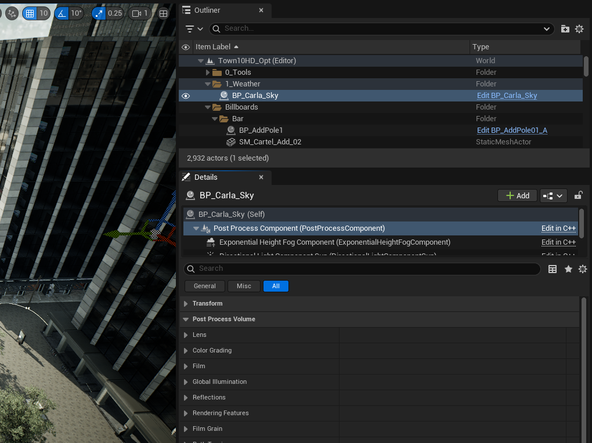
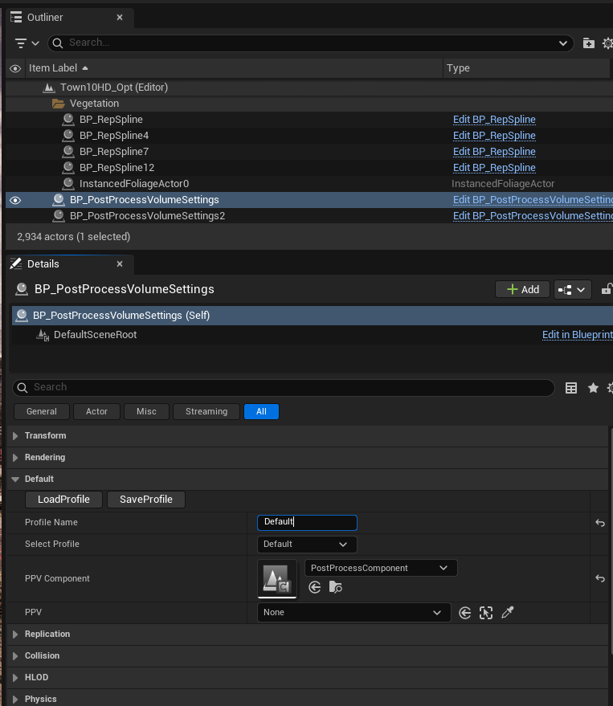

# Camera post-process presets

## Creating, loading and saving presets

The look of the scene through the camera can be adjusted using the post-process settings of the `BP_CarlaSky` blueprint. To adjust post-process settings, select the `BP_CarlaSky` blueprint in the *Outliner* panel of the Unreal Editor interface. Then in the *Details* section, select the *Post Process Component* and expand the *Post Process Volume* section. Here you will find parameters for lens effects like bloom and lens flares, color temperature, exposure, film grain and others. Experiment with the parameters to see the effect each one has on the scene in the spectator. You can find more details about these parameters in the [Unreal Engine documentation](https://dev.epicgames.com/documentation/en-us/unreal-engine/API/Runtime/Engine/Engine/FPostProcessSettings).



Post-process parameter presets can be saved and loaded through the `BP_PostProcessVolumeSettings` blueprint. In the content browser navigate to `Carla/Blueprints/CameraProfiles` or search for the blueprint in the search field. Drag the blueprint into the scene and make sure it is selected in the *Outliner*, you may want to place it out of the way in the sky so it doesn't get in the way of other scene elements. In the details panel, expand the *Default* section.



To save your current post process settings, choose an appropriate name and enter it in the *Profile Name* field, then press *SaveProfile*. The profile will be saved as a JSON file in the `${CARLA_ROOT}/Unreal/CarlaUnreal/Content/Carla/Config/PostProcess` directory, where you will also find other presets. If you want to load an existing preset from this directory, enter the name of the preset (the name of the JSON file minus the `.json` suffix) in the *Profile Name* field and then press *LoadProfile*.

You can also create new post-process presets directly in the JSON files found in the *PostProcess* directory. Create new profiles by copying an existing JSON preset and editing specific parameters. Make sure you follow the expected JSON schema, some options may change the schema. If in doubt, save the preset from the editor interface instead.

---

## Using post-process presets for the RGB camera sensor

Saved post-process presets can be loaded to modify the RGB camera sensor. When spawning a camera in the simulation through the CARLA Python API, set the `post_process_profile` attribured of the camera blueprint to the name of the post-process preset you wish to use (the name of the JSON file minus the `.json` suffix):

```py
camera_bp = bp_lib.find('sensor.camera.rgb')
camera_bp.set_attribute('post_process_profile', 'GoPro')
camera = world.spawn_actor(camera_bp, carla.Transform(carla.location(0,0,1.5), carla.Rotation()))
```

